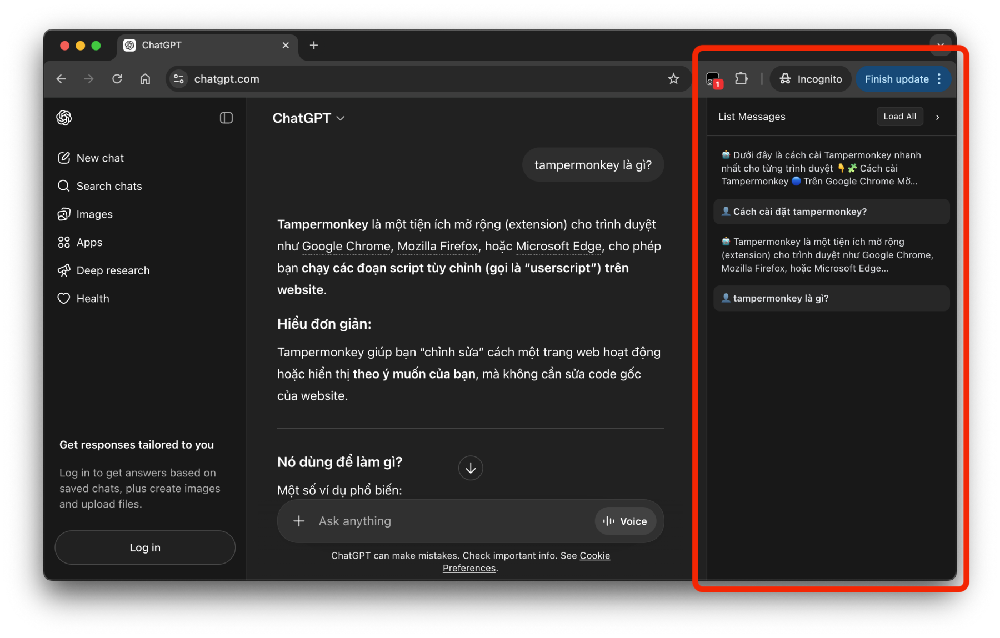

# ChatGPT Message Navigator (Tampermonkey Script)

## Introduction

This script adds a **message list panel** on the right side of the ChatGPT interface (chatgpt.com), allowing you to:

* Quickly view all messages in the current conversation.
* Click to **quickly scroll** to any message.
* Improve the experience when conversations are long.

---

## Demo



---

## Installation Guide

### 1. Install Tampermonkey

* Chrome: https://www.tampermonkey.net/.
* Firefox / Edge / Safari / ...: also supported similarly.

### 2. Install the script

* Open Tampermonkey.
* Select **Create a new script**.
* Delete all default content.
* Paste the code from `index.js` of this script.
* Click **Save (Ctrl + S)**.

### 3. Usage

* Visit: https://chatgpt.com
* The message list panel will automatically appear on the right.

---

## Main Features

* Automatically scans and updates the message list.
* Click to scroll to the corresponding message.
* Lightweight UI, does not affect the main layout.
* Supports dark mode.

---

## Contribution

All contributions are welcome:

* Fork the repo.
* Create a new branch.
* Commit changes.
* Create a Pull Request.

You can contribute by:

* Improving UI/UX.
* Optimizing performance.
* Adding new features.
* Fixing bugs.

---

## Bug Report

If you encounter an issue, please create an issue with the following information:

**Title:** a brief description of the bug.

**Content:**

* Detailed description of the issue.
* Steps to reproduce.
* Expected result.
* Screenshots (if any).
* Browser + version.

Example:

```
- Browser: Chrome 122
- Tampermonkey version: x.x.x
- Description: list does not update when a new message appears
```

---

## Acknowledgement

This idea was inspired by a post on [Facebook](https://www.facebook.com/share/p/1DYEgsx5Kh/).

## License

MIT License.

---

## Notes

This script is not officially affiliated with OpenAI or ChatGPT.  
It is simply a community-developed utility to improve user experience.